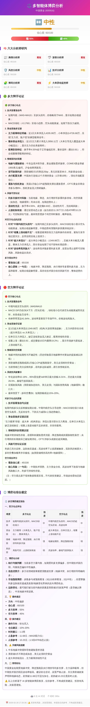

# AstrBot 基金/股票智能分析插件


[](https://opensource.org/licenses/Apache-2.0)
[](https://www.python.org/downloads/)
[](https://astrbot.app)

> **AI 多智能体博弈 + 量化分析** —— 让投资决策更科学、更高效

为 AstrBot 提供专业的基金/股票数据分析功能。集成 **多智能体博弈分析**、**AI 智能量化分析**、实时行情、技术分析、量化指标、策略回测等丰富特性。

---

## ⚖️ 特色功能一：多智能体博弈分析（股票智能分析）

### 灵感来源

本功能的多智能体博弈架构借鉴了开源项目 **[FinGenius](https://github.com/HuaYaoAI/FinGenius)** —— 全球首个 A 股博弈多智能体应用。FinGenius 采用 Research–Battle 双环境多智能体架构，通过博弈论思想优化投资决策，在本插件中我们将其核心理念适配到 AstrBot 聊天机器人场景。

### 架构设计

```
Phase 1: 六大 Agent 并行独立分析（6 次 LLM 调用，并发执行）
Phase 2: 多方辩手综合看涨论据（1 次 LLM 调用）
Phase 3: 空方辩手综合看跌论据 + 反驳多方（1 次 LLM 调用）
Phase 4: 裁判运用博弈论进行综合裁定（1 次 LLM 调用）
```

### 六大 AI 分析角色（可扩展）

当前内置 6 个分析角色，覆盖主流分析维度。角色定义位于 `stock/agent_prompts.py`，开发者可自由增减或替换为更专业的角色：

| Agent | 职责 | 分析维度 |
|-------|------|----------|
| 📰 舆情分析师 | 市场情绪量化 | 新闻舆论、恐慌/贪婪指数、情绪拐点 |
| 🦈 游资分析师 | 龙虎榜解读 | 超大单动向、换手率异动、游资进出节奏 |
| 🛡️ 风控分析师 | 风险预警 | 政策风险、地缘冲突、VaR/最大回撤 |
| 📊 技术分析师 | 技术信号研判 | MACD/RSI/KDJ/布林带、支撑阻力位 |
| 🧩 筹码分析师 | 主力行为识别 | 主力成本区间、吸筹/洗盘/出货阶段判断 |
| ⚡ 大单异动师 | 资金异动监控 | 量价配合关系、放量缩量信号、异动检测 |

> **关于效果预期**：本插件使用通用大语言模型（如 GPT-4、Claude、Gemini 等）扮演分析角色，受限于 token 开销和通用模型在金融领域的局限性，分析深度**远不及**专业金融智能体或量化模型。本功能更侧重于提供**多视角思维框架**和**结构化分析流程**，帮助用户从不同维度审视标的，而非替代专业投资分析。
>
> 欢迎社区贡献更多分析角色、优化 Prompt 或接入专业数据源，让辩论更加多样和深入！

### 博弈论裁定

引入经典博弈论思想（纳什均衡、信息不对称分析），裁判综合评估多空双方论点强度，给出：
- 最终方向判断（看涨/看跌/中性）+ 信心度评分
- 多方胜率 vs 空方胜率
- 具体操作建议（买入/持有/观望/减仓）+ 止盈止损参考

### 输出形式

- **图片报告**：精美 HTML 渲染，包含投票面板、多空胜率条、辩论详情、裁判裁定
- **文字结论**：简洁纯文本摘要，方便快速阅读

### 效果展示

<details>
<summary>👆 点击展开查看示例图片</summary>



</details>

> 💡 **使用方法**：发送 `股票智能分析 161226` — 共 9 次 AI 对话，约 3-5 分钟出结果

---

## 🤖 特色功能二：AI 智能量化分析（智能分析）

### 让 AI 成为你的投资顾问

- 🧠 **深度量化解读** — AI 结合夏普比率、最大回撤等专业指标，给出通俗易懂的解读
- 📈 **技术面综合研判** — 融合 MACD、RSI、KDJ、布林带等多维度技术指标
- 🔮 **趋势预测建议** — 短期/中期走势分析，把握入场时机
- ⚠️ **智能风险预警** — 基于历史数据和市场情绪的风险评估
- 💡 **个性化投资建议** — 根据基金类型定制分析策略
- 📰 **市场动态融合** — 自动采集相关新闻，分析影响因素

### 效果展示

<details>
<summary>👆 点击展开查看示例图片</summary>


</details>

> 💡 **使用方法**：发送 `智能分析 161226` 即可获取 AI 量化分析报告
>
> ⚙️ **配置要求**：需在 AstrBot 管理面板配置 LLM 提供商（OpenAI、Claude、Gemini 等）

---

## 📋 命令一览

### 🌟 AI 分析指令

| 命令 | 说明 | 示例 |
|------|------|------|
| `股票智能分析 [代码]` | ⚖️ 多智能体博弈分析（9次AI对话） | `股票智能分析 161226` |
| `智能分析 [代码]` | 🤖 AI 量化深度分析 | `智能分析 161226` |

### 📊 行情与分析指令

| 命令 | 说明 | 示例 |
|------|------|------|
| `基金 [代码]` | 查询基金实时行情 | `基金 161226` |
| `股票 <代码>` | 查询 A 股实时行情 | `股票 000001` |
| `基金分析 [代码]` | 技术指标分析 | `基金分析 161226` |
| `量化分析 [代码]` | 专业量化绩效指标 | `量化分析 161226` |
| `基金对比 [代码1] [代码2]` | 两只基金对比分析 | `基金对比 161226 513100` |
| `基金历史 [代码] [天数]` | 查看历史行情 | `基金历史 161226 20` |
| `今日行情` | 金银贵金属实时行情 | `今日行情` |

### 🔧 工具指令

| 命令 | 说明 | 示例 |
|------|------|------|
| `搜索基金 关键词` | 搜索 LOF 基金 | `搜索基金 白银` |
| `搜索股票 关键词` | 搜索 A 股股票 | `搜索股票 茅台` |
| `设置基金 代码` | 设置默认基金 | `设置基金 161226` |
| `基金帮助` | 显示帮助信息 | `基金帮助` |

---

## 📦 安装配置

### 系统要求
- Python 3.10 或更高版本
- AstrBot v4.0 或更高版本
- 网络连接（获取行情数据）

### 安装步骤

1. **克隆插件到 AstrBot 插件目录**
```bash
cd AstrBot/data/plugins/
git clone https://github.com/2529huang/astrbot_plugin_zhouzhou.git astrbot_plugin_fund_analyzer
```

2. **安装 Python 依赖**
```bash
cd astrbot_plugin_fund_analyzer
pip install -r requirements.txt
```

或手动安装：
```bash
pip install akshare pandas
```

3. **重启 AstrBot 或热重载插件**

---

## 📊 量化指标说明

| 指标类型 | 指标名称 | 说明 |
|----------|----------|------|
| **收益指标** | 夏普比率 | >1 表示风险调整后收益较好 |
| **收益指标** | 索提诺比率 | 只考虑下行风险的收益比 |
| **收益指标** | 卡玛比率 | 年化收益 / 最大回撤 |
| **风险指标** | 最大回撤 | 历史最大亏损幅度 |
| **风险指标** | VaR (95%) | 95%概率下的最大日亏损 |
| **风险指标** | 年化波动率 | 价格波动程度 |
| **技术指标** | RSI | >70 超买，<30 超卖 |
| **技术指标** | MACD | 红柱看涨，绿柱看跌 |

## ⚠️ 免责声明

**投资有风险，入市需谨慎！**

- 本插件仅提供数据查询和技术分析功能，**不构成任何投资建议**
- 多智能体博弈分析基于 AI 推演，**不代表真实市场走势**
- 量化回测基于历史数据，**不代表未来表现**
- 投资者应根据自身风险承受能力做出独立判断
- 开发者不对因使用本插件产生的任何损失负责

## 🙏 感谢 & 参考

- [FinGenius](https://github.com/HuaYaoAI/FinGenius) - A 股博弈多智能体应用（多智能体博弈架构灵感来源）
- [AKShare](https://github.com/akfamily/akshare) - 开源金融数据接口
- [AstrBot](https://github.com/AstrBotDevs/AstrBot) - 多平台 LLM 聊天机器人框架

## 📄 开源许可

本项目采用 [Apache License 2.0](LICENSE) 开源许可证。

